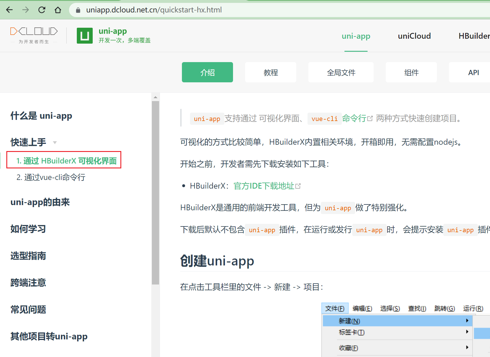
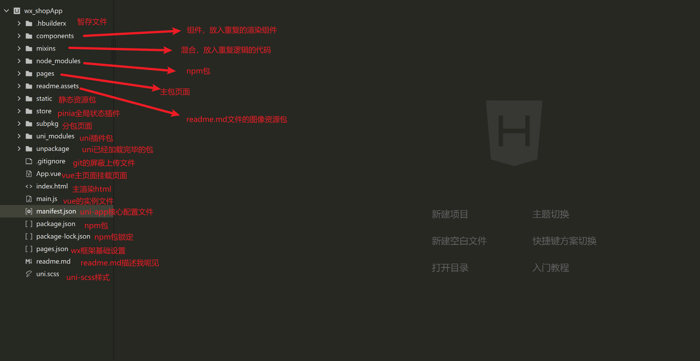

# 使用uni-app
官网地址

uni-app框架： https://uniapp.dcloud.net.cn/

wx框架：https://developers.weixin.qq.com/miniprogram/dev/framework/

项目展示地址：


## 安装官方工具（推荐）

## 安装官方包（不推荐，有巨坑！完全没有维护过的文档。。。）



```
基于@vue框架：

Wepy框架
uni-app框架(国内推荐这个，兼容性好，模板多)
myvue框架

基于@React框架：

Remax框架
Taro框架
chameleon框架（推荐，原生支持跨端开发）

```

## 初始化项目

项目文件结构




推荐网路请求包

```
npm install @escook/request-miniprogram
```

全局状态插件

```
# wx官网文档推荐
npm i mobx-miniprogram mobx-miniprogram-bindings
# 基于uni-app则是vuex
npm i vuex


# 基于下一代全局状态插件(推荐，我也是基于它开发的。)
npm i pinia
```

项目完毕后

```
uni-app框架，似是而非，说是vue2，其实感觉是一种vue2+vue3+wx+uni的一种混合框架，有自己的高级对象uni，同时兼容vue23两种语法书写。存在自己的uni自己生命周期钩子，但混合了vue3-setup以及vue2的语法糖，uni的高级对象确实比wx对象强太多了。。。

最后本项目无偿开源，欢迎各位同行取用。
```

